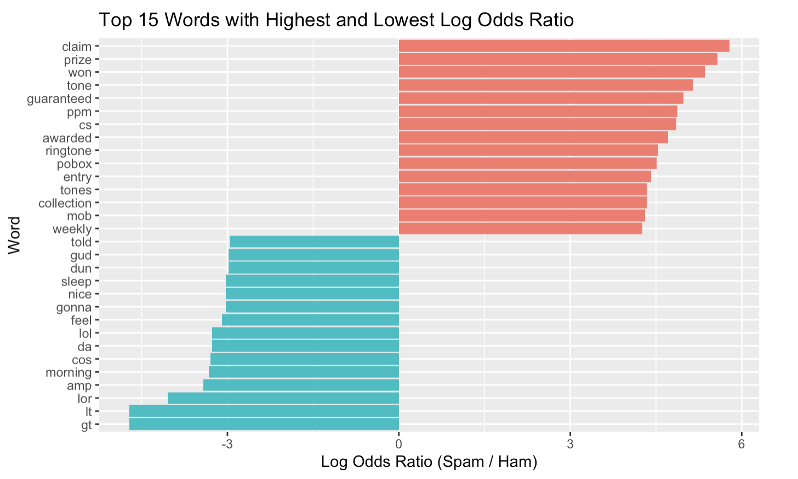
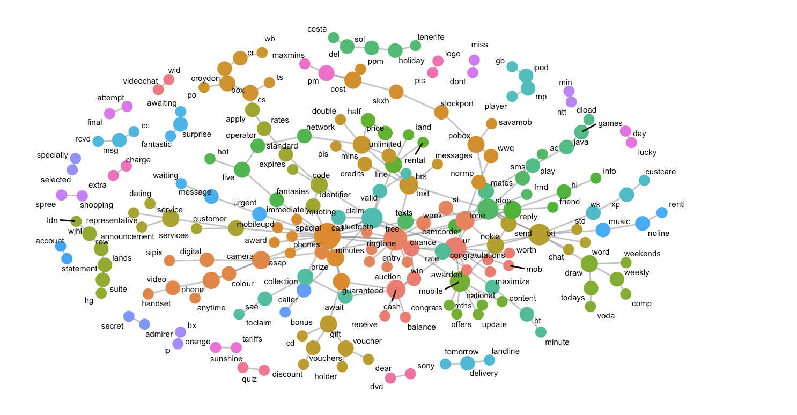
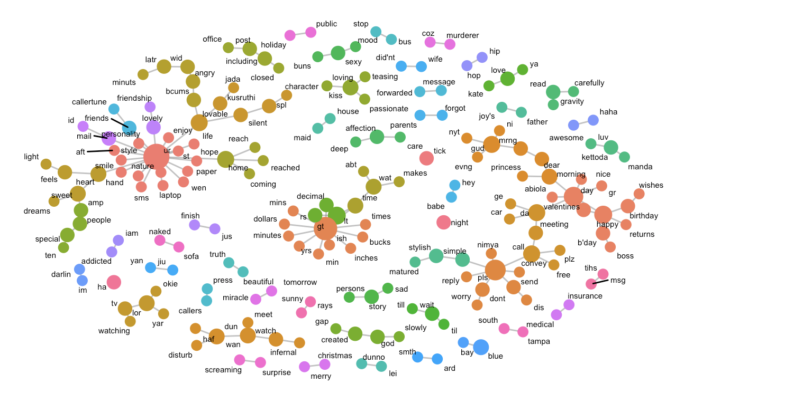

# Executive summary

My main question is to identify the distinct characteristics of spam and ham messages through their datasets, and to discover unique features that can differentiate spam messages. This can help in identifying spam messages and be useful for developing spam detection algorithms. 
I aimed to use the log odds ratio to identify the most frequently used words in spam and ham emails, creating a graph that includes the top 15 words for each. 
Additionally, I intended to use bigrams to track the commonly used words in spam and ham emails and the words that are frequently associated with them. To achieve this, I visualized node and edge graphs for spam and ham emails.


# Data background

The SMS Spam Collection is a set of SMS tagged messages that have been collected for SMS spam research. It contains 5,574 SMS messages in English, tagged as either ham (legitimate) or spam.
Additionally, a collection of 425 SMS spam messages was manually extracted from the Grumbletext website. This is a UK forum where cell phone users publicly report claims about SMS spam messages, most of them without including the actual spam messages they received.
This dataset is divided into two columns: type and text. The type column represents the type of message and is usually divided into "spam" and "ham", where "spam" refers to spam messages and "ham" refers to legitimate messages. The text column contains the actual message content, including either spam or legitimate messages.
I filtered the top 10 positive and negative words in the spam and ham messages from the dataset and visualized them. The code is as follows:

```{r setup, include=FALSE}
# Add libraries
library(tidyverse)
library(tidytext)
library(tidyverse)
library(tidytext)
library(wordcloud)
library(textdata)
library(ggplot2)
library(tidyverse)
library(tidytext)
library(tm)
library(wordcloud)
library(textdata)
library(ggplot2)
library(broom)
library(patchwork)
library(gridExtra)
library(ggraph)
library(patchwork)

spam_data <- read.csv("spam.csv", stringsAsFactors = FALSE)

colnames(spam_data) <- c("type", "text", "col3", "col4", "col5")

tokenized_data <- spam_data %>%
  unnest_tokens(word, text)

word_freq <- tokenized_data %>%
  anti_join(stop_words, by = "word")

spam_words <- tokenized_data %>%
  filter(type == "spam")
ham_words <- tokenized_data %>%
  filter(type == "ham")

spam_word_freq <- spam_words %>%
  count(word, sort = TRUE)

ham_word_freq <- ham_words %>%
  count(word, sort = TRUE)

bing_sentiments <- get_sentiments("bing")

spam_sentiment <- spam_words %>%
  inner_join(bing_sentiments, by = "word")

ham_sentiment <- ham_words %>%
  inner_join(bing_sentiments, by = "word")

# 긍정 및 부정 단어 상위 10개 필터링
spam_positive <- spam_sentiment %>%
  filter(sentiment == "positive") %>%
  count(word, sort = TRUE) %>%
  top_n(10)

spam_negative <- spam_sentiment %>%
  filter(sentiment == "negative") %>%
  count(word, sort = TRUE) %>%
  top_n(10)

ham_positive <- ham_sentiment %>%
  filter(sentiment == "positive") %>%
  count(word, sort = TRUE) %>%
  top_n(10)

ham_negative <- ham_sentiment %>%
  filter(sentiment == "negative") %>%
  count(word, sort = TRUE) %>%
  top_n(10)

# 시각화 함수 정의
plot_sentiment <- function(data, title) {
  ggplot(data, aes(x = reorder(word, n), y = n, fill = word)) +
    geom_bar(stat = "identity") +
    coord_flip() +
    theme_minimal() +
    labs(title = title, x = "Word", y = "Count") +
    theme(legend.position = "none")
}

# 그래프 생성
plot_spam_positive <- plot_sentiment(spam_positive, "Top 10 Positive Words in Spam Messages")
plot_spam_negative <- plot_sentiment(spam_negative, "Top 10 Negative Words in Spam Messages")
plot_ham_positive <- plot_sentiment(ham_positive, "Top 10 Positive Words in Ham Messages")
plot_ham_negative <- plot_sentiment(ham_negative, "Top 10 Negative Words in Ham Messages")

# 그래프 결합
combined_plot <- (plot_spam_positive | plot_spam_negative) / (plot_ham_positive | plot_ham_negative)

# 그래프 출력
print(combined_plot)
```


# Data loading, cleaning and preprocessing
First, I modified the column names in the spam dataset to make them easier to identify and removed unnecessary columns. Then, using regular expressions, I removed URLs and numbers from the text data. After that, I tokenized the text and removed stop words from the dataset.
The code is as follows:
```{r}
# 데이터 로드
spam_data <- read.csv("spam.csv", stringsAsFactors = FALSE)


# 컬럼 이름 변경 (v1: type, v2: text)
colnames(spam_data) <- c("type", "text", "col3", "col4", "col5")

# 필요없는 열 제거
spam_data <- spam_data %>% select(type, text)


# URL과 숫자를 제거하는 함수
remove_urls_and_numbers <- function(text) {
  text <- str_remove_all(text, "http\\S+|www\\S+")  # URL 제거
  text <- str_remove_all(text, "\\d+")  # 숫자 제거
  return(text)
}

# 텍스트 데이터에서 URL과 숫자 제거
spam_data <- spam_data %>% mutate(text = remove_urls_and_numbers(text))

# 텍스트 토큰화
tokenized_data <- spam_data %>%
  unnest_tokens(word, text)

# 불용어 제거
data("stop_words")
word_freq <- tokenized_data %>%
  anti_join(stop_words, by = "word")
```


# Text data analysis


## Anaysis and Figure 1


<center>

</center>

I analyzed the frequently used words in spam and ham messages using the log odds ratio.
The analysis using the log odds ratio identified the most prominent words in spam and ham messages. In spam messages, words like "claim," "prize," and "won" have a high ratio, whereas in ham messages, words like "gt," "lt," and "lor" appear frequently. These words are highly indicative of the type of message, providing key clues for distinguishing between spam and legitimate messages.
The chart visualizes the frequently used words in spam and ham messages based on their log odds ratio. From this chart, we can see that spam messages commonly use commercial or enticing words, while ham messages often include words used in everyday conversations.
The code is as follows:
```{r}

spam_words <- word_freq %>%
  filter(type == "spam")
ham_words <- word_freq %>%
  filter(type == "ham")

# Calculate word frequencies for spam messages
spam_word_freq <- spam_words %>%
  count(word) %>%
  mutate(label = "spam")

# Calculate word frequencies for ham messages
ham_word_freq <- ham_words %>%
  count(word) %>%
  mutate(label = "ham")

# Bind the two datasets together
word_freq <- bind_rows(spam_word_freq, ham_word_freq)

# Show the combined dataset
head(word_freq)


# Spread the data for calculating log odds ratio
word_freq_spread <- word_freq %>%
  spread(label, n, fill = 0) %>%
  mutate(total = spam + ham)

# Show the spread dataset
head(word_freq_spread)

# Calculate the log odds ratio
log_odds <- word_freq_spread %>%
  mutate(log_odds = log((spam + 1) / (sum(spam) + 1)) - log((ham + 1) / (sum(ham) + 1)))

# Show the log odds ratio
head(log_odds)

top_words <- log_odds %>%
  group_by(log_odds < 0) %>%
  slice_max(abs(log_odds), n = 15) %>% 
  ungroup() %>%
  mutate(word = reorder(word, log_odds))

ggplot(top_words, aes(word, log_odds, fill = log_odds < 0)) +
  geom_col(show.legend = FALSE) +
  coord_flip() +
  labs(x = "Word", y = "Log Odds Ratio (Spam / Ham)",
       title = "Top 15 Words with Highest and Lowest Log Odds Ratio")
```


## Anaysis and Figure 2

<center>

</center>

I tokenized the text data of spam messages, removed stop words, and then created bigrams to analyze the word pairs.
The network graph visualizes the frequently co-occurring word pairs in spam messages. Nodes with high centrality in the graph represent words that are often used together, highlighting key features of spam messages. For example, words like "prize," "won," and "claim" are commonly found in spam messages and typically contain commercial or enticing content. Additionally, these words are often used with time-expressing words like "asap" and "minutes," urging the recipient to take immediate action.
The code is as follows:
```{r}


library(tidyverse)
library(tidytext)
library(tidyr)
library(tidygraph)
library(ggraph)

# 데이터 로드
spam_data <- read.csv("spam.csv", stringsAsFactors = FALSE)


# 컬럼 이름 변경 (v1: type, v2: text)
colnames(spam_data) <- c("type", "text", "col3", "col4", "col5")

# 필요없는 열 제거
spam_data <- spam_data %>% select(type, text)

# "spam" 데이터만 선택
spam_only <- spam_data %>% filter(type == "spam")

# URL과 숫자를 제거하는 함수
remove_urls_and_numbers <- function(text) {
  text <- str_remove_all(text, "http\\S+|www\\S+")  # URL 제거
  text <- str_remove_all(text, "\\d+")  # 숫자 제거
  return(text)
}

# 텍스트 데이터에서 URL과 숫자 제거
spam_only$text <- sapply(spam_only$text, remove_urls_and_numbers)


# n-gram 생성 (bigram 예시)
spam_bigrams <- spam_only %>%
  unnest_tokens(input = text,
                output = bigram,
                token = "ngrams",
                n = 2)

# bigram 분리
bigram_separated <- spam_bigrams %>%
  separate(bigram, c("word1", "word2"), sep = " ")

# 불용어 제거
data("stop_words")
bigram_filtered <- bigram_separated %>%
  filter(!word1 %in% stop_words$word,
         !word2 %in% stop_words$word)

# 단어 쌍 빈도 계산
bigram_counts <- bigram_filtered %>%
  count(word1, word2, sort = TRUE) %>%
  na.omit()

# 노드와 엣지 데이터 확인
nodes <- bigram_counts %>%
  select(word1) %>%
  distinct() %>%
  rename(label = word1)

edges <- bigram_counts %>%
  rename(from = word1, to = word2)

# 노드와 엣지 데이터 출력
print(head(nodes, 5))
print(head(edges, 5))


# 네트워크 그래프 데이터 생성
graph_bigram <- bigram_counts %>%
  filter(n >= 5) %>% 
  as_tbl_graph(directed = FALSE) %>%
  mutate(centrality = centrality_degree(),    # 중심성
         group = as.factor(group_infomap()))  # 커뮤니티

set.seed(1234)
ggraph(graph_bigram, layout = "fr") +
  geom_edge_link(color = "gray50",             # 엣지 색상
                 alpha = 0.5) +                # 엣지 명암
  geom_node_point(aes(size = centrality,       # 노드 크기
                      color = group),          # 노드 색상
                  show.legend = FALSE) +       # 범례 제거
  scale_size(range = c(3, 8)) +               # 노드 크기 범위
  geom_node_text(aes(label = name),
                 repel = TRUE,
                 size = 2,                    # 노드 텍스트 크기 축소
                 max.overlaps = 100) +        # max.overlaps 값 증가
  theme_graph()

```


## Anaysis and Figure 3

<center>

</center>

I also analyzed ham messages. The network graph visualizes the frequently co-occurring word pairs in ham messages. Nodes with high centrality in the graph represent words that are often used together, highlighting key features of ham messages. For example, words like "friendship," "lovely," and "enjoy" are commonly found in ham messages.
Additionally, words like "gt," "lt," and "mins" are frequently used to express time or dates, showing patterns commonly found in everyday conversations. This reflects one of the main characteristics of ham messages, which is their relevance to daily life interactions.
The code is as follows:
```{r}

# 데이터 로드
spam_data <- read.csv("spam.csv", stringsAsFactors = FALSE)


# 컬럼 이름 변경 (v1: type, v2: text)
colnames(spam_data) <- c("type", "text", "col3", "col4", "col5")

# 필요없는 열 제거
spam_data <- spam_data %>% select(type, text)

# "spam" 데이터만 선택
spam_only <- spam_data %>% filter(type == "ham")

# URL과 숫자를 제거하는 함수
remove_urls_and_numbers <- function(text) {
  text <- str_remove_all(text, "http\\S+|www\\S+")  # URL 제거
  text <- str_remove_all(text, "\\d+")  # 숫자 제거
  return(text)
}

# 텍스트 데이터에서 URL과 숫자 제거
spam_only$text <- sapply(spam_only$text, remove_urls_and_numbers)


# n-gram 생성 (bigram 예시)
spam_bigrams <- spam_only %>%
  unnest_tokens(input = text,
                output = bigram,
                token = "ngrams",
                n = 2)

# bigram 분리
bigram_separated <- spam_bigrams %>%
  separate(bigram, c("word1", "word2"), sep = " ")

# 불용어 제거
data("stop_words")
bigram_filtered <- bigram_separated %>%
  filter(!word1 %in% stop_words$word,
         !word2 %in% stop_words$word)

# 단어 쌍 빈도 계산
bigram_counts <- bigram_filtered %>%
  count(word1, word2, sort = TRUE) %>%
  na.omit()

# 노드와 엣지 데이터 확인
nodes <- bigram_counts %>%
  select(word1) %>%
  distinct() %>%
  rename(label = word1)

edges <- bigram_counts %>%
  rename(from = word1, to = word2)

# 노드와 엣지 데이터 출력
print(head(nodes, 5))
print(head(edges, 5))

# 네트워크 그래프 데이터 생성
graph_bigram <- bigram_counts %>%
  filter(n >= 4) %>%
  as_tbl_graph(directed = FALSE) %>%
  mutate(centrality = centrality_degree(),    # 중심성
         group = as.factor(group_infomap()))  # 커뮤니티

set.seed(1234)
ggraph(graph_bigram, layout = "fr") +
  geom_edge_link(color = "gray50",             # 엣지 색상
                 alpha = 0.5) +                # 엣지 명암
  geom_node_point(aes(size = centrality,       # 노드 크기
                      color = group),          # 노드 색상
                  show.legend = FALSE) +       # 범례 제거
  scale_size(range = c(3, 8)) +               # 노드 크기 범위
  geom_node_text(aes(label = name),
                 repel = TRUE,
                 size = 2,                    # 노드 텍스트 크기 축소
                 max.overlaps = 200) +        # max.overlaps 값 증가
  theme_graph()

```
